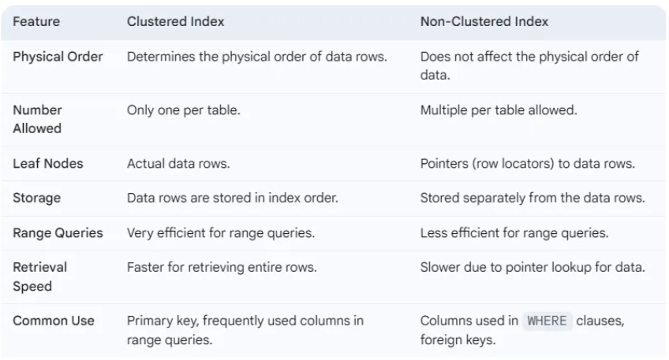
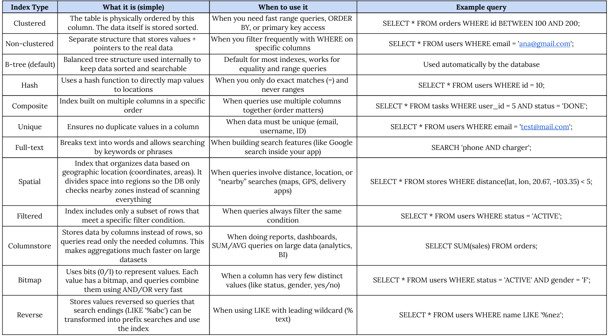

# Session - 2026-04-14  

## Topics covered  

- Full scan index  
- Balance tree B-tree in index  
- Composite index  
- Partial index  
- Problems or disadvantage of using index  

## What I understood  

### What are indexes?

Indexes work like the index of a book. Instead of scanning the entire table row by row (full scan), the database can use an index to jump directly to the data it needs, which makes queries much faster, especially when the table is large. Behind the scenes, most databases use a structure called a B-tree, which keeps data sorted and balanced, so searching, inserting, and deleting can be done efficiently.

### Types of indexes:

**Composite index**
A composite index is an index that includes multiple columns together. For example:

```sql
CREATE INDEX idx_user_status_date
ON tasks(user_id, status, due_date);
```

This works very well for queries like:

```sql
SELECT *
FROM tasks
WHERE user_id = 5
AND status = 'DONE'
AND due_date > '2026-04-01';
```

because the database can use all those columns together in the same index. However, since the order of the columns matters (the database reads the index from left to right, the order in this case being: user_id,status,due_date). It works well if you filter by `user_id`, or by `user_id` + `status`, or all three. But it does not work as well if you only search by `status`, because that column is not first in the index.


**Separate indexes**
Separate indexes are just individual indexes per column:

```sql
CREATE INDEX idx_user_id ON tasks(user_id);
CREATE INDEX idx_status ON tasks(status);
CREATE INDEX idx_due_date ON tasks(due_date);
```

These are better when you usually search those columns independently. So we use composite indexes when columns are used together in queries, and we use separate indexes when they are used separately.


**Clustered index and Unclustered index**

A clustered index is an index where the table is physically ordered based on a column. This means the data itself is stored in the same order as the index. In contrast, a non-clustered index is a separate structure that does not change how the table is stored, but instead keeps a sorted list of values with pointers to the actual data rows.Both use a B-tree structure, but he difference is what is stored in the leaf nodes. In a clustered index, the leaf nodes contain the actual data rows. In a non-clustered index, the leaf nodes contain pointers (row locators) to where the data is stored in the table.A table can only have one clustered index because the data can only be physically ordered one way. But it can have multiple non-clustered indexes because they are separate structures.

Examples of how to creaate these indexes:

- Clustered
```sql
CREATE CLUSTERED INDEX idx_lastname
ON PhoneBook(LastName);
````

- Non-clustered
```sql
CREATE INDEX idx_email
ON users(email);
```

Clustered indexes are very efficient for range queries. For example:

```sql
SELECT * FROM orders
WHERE id BETWEEN 100 AND 200;
```

Because the data is physically ordered, the database finds 100 and then just reads sequentially until 200. This is very fast because the data is stored contiguously. Non-clustered indexes are less efficient for range queries when many rows are involved, because the database has to follow pointers back to the table for each row.

Clustered indexes are better for:

* primary keys
* columns used in range queries
* columns used in ORDER BY
* columns that are unique and stable (do not change often)

Don't use them when:

* the column is frequently updated (because reordering is expensive)
* inserts happen randomly (can cause page splits and fragmentation)

Non-clustered indexes are better for:

* columns frequently used in WHERE clauses
* foreign keys
* columns used for filtering but not ordering the entire table

Don't use them when:

* the table has too many indexes (slows down inserts/updates)
* the column has low selectivity (many repeated values)
* queries return a large percentage of the table (full scan may be better)


**Summary and more about index types**


### Disadvantages of using indexes

They improve read performance, but they slow down writes. Every time you do an `INSERT`, `UPDATE`, or `DELETE`, the database also has to update the indexes. They also take extra storage space. So adding too many indexes can hurt performance instead of helping. The key idea is to only create indexes where they actually provide value.


## Something new I learned  


I learned that the structure behind indexes (like B-trees) is what makes them efficient, not just the idea of “having an index.” And that there are a lot of type of indexes that cover greatly the different use cases of a query.


Finally, I learned the database does not randomly decide which index to use. It has something called a query optimizer, which analyzes the query and decides the best execution plan. It compares options like using an index vs doing a full table scan, and picks the one with the lowest cost. This depends on things like how many rows are expected, how selective the condition is, and how much data needs to be read.

The selectivity mentioned above is how much a condition reduces the number of rows. For example:

```sql
WHERE email = 'yo@gmail.com'
```

is very selective because it probably returns one row. But:

```sql
WHERE status = 'ACTIVE'
```

may return a large portion of the table, so the index is not as useful. If a condition is not selective, sometimes the database prefers a full scan instead of using an index.


## What is still confusing  

- how each type of index works more specifically.
- A more detailed explanaation in how b-trees manage the indexes

## Questions  

Nothing

## Related concepts  

- Query optimization  
- B-tree data structures  


## Resources used  

- https://medium.com/@sofiasondh/what-is-index-in-sql-142c50983328 


