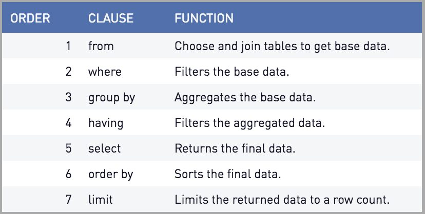

# Session - 2026-03-03

## Topics covered
- OVER() 
- Partition

## What I understood
- Order BY inside the OVER() changes its behaviour depending on the aggregated function yhay id bring used. For the SUM, it applies an accumulative sum.

- Only with aggregate function:
Aggregate functions squash the output to one row per group.  
    For example:
    select count(*) from bricks; 
    It returns 6 if there are 6 rows.

- Using over()
Adding the over clause converts it to an analytic. This preserves the input rows. So you get all six, each with the value six:
select count(*) over () from bricks;

- Order of execution

## What is still confusing
- 
## Questions
- Nothing

## Related concepts
- 

## Resources used

- 