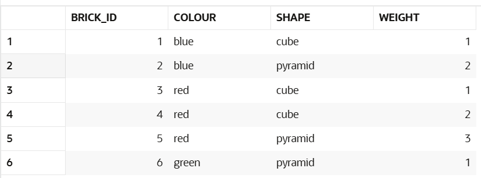
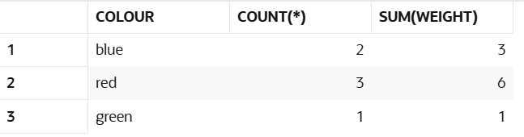
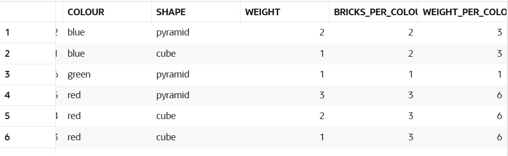
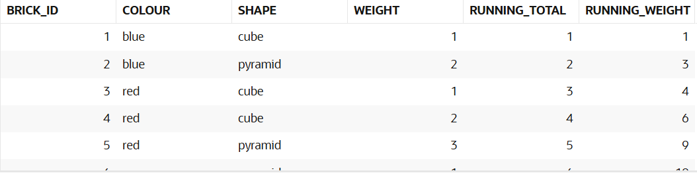
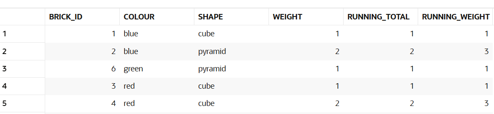

# Session - 2026-03-03

## Topics covered
- OVER() 
- Partition

## What I understood
- ORIGINAL TABLE:

***************************************** over() *****************************************
- When using OVER() is like creating a window which is a group of rows, if over doesn't has parameters, the window has all the rows from the table. But if it has something like partition by "column", it will group the rows based on that column. A window is just a group of rows that sql will apply the indicated aggregated functions and it will create a new column and the value gotten will be put in each row in that column. So, with over you create this window that is a group of rows that will be applied the aggregate function and then add the result next to it as a new value.
example:
| id | colour | count |
| -- | ------ | ----- |
| 1  | red    | 5     |
| 2  | red    | 5     |
| 3  | red    | 5     |
| 4  | blue   | 5     |
| 5  | blue   | 5     |

- Order BY inside the OVER() changes its behaviour depending on the aggregated function yhay id bring used. For the SUM, it applies an accumulative sum. 

- Only with aggregate function:
Aggregate functions squash the output to one row per group.  
    For example:
    select count(*) from bricks; 
    It returns 6 if there are 6 rows.

- USING OVER()
Adding the over clause converts it to an analytic. This preserves the input rows. So you get all six, each with the value six:
select count(*) over () from bricks;
So, in this example with over() you created a window, which has all the rows of the table bricks and it will count all of them and it will get a 6 and it will create a new column in which it will put that 6 to each row.

***************************************** OVER's arguments*****************************************

+++++++++++++++++++++++++++++++++++++++++ Partition by +++++++++++++++++++++++++++++++++++++++++++
- First, just using group by
select colour, count(*), sum ( weight )
from   bricks
group  by colour;

- Then using partition by
select b.*,
       count(*) over (partition by colour)  bricks_per_colour,
       sum (weight) over (partition by colour) weight_per_colour
from   bricks b;

In the example we can see that with partition by we said that the aanalyzed window should be divided by colours, so the count(*) is done by each colour, so in bricks per colour puts how many there are per colour. Then in sum(weight) it is also applied by colour only that it adds up the weights and aaccording to the same colours.

+++++++++++++++++++++++++++++++++++++++++ Order by +++++++++++++++++++++++++++++++++++++++++++
With order by you say which column order will be followed to grow the window. The window's size is from the first row to the current row

Example:
select b.*,
       count(*) over (order by brick_id) running_total,
       sum (weight) over (order by brick_id) running_weight
from   bricks b;

The order by is applied as follows
* brick_id = 1, window = [1], running_total = 1 = 1, running_weight = 1 = 1
* brick_id = 2, window = [1,2], running_total = 2 = 2, running_weight = 1 + 2 = 3
* brick_id = 3, window = [1,2,3], running_total = 3 = 3, running_weight = 1 + 2 + 1 = 4
* brick_id = 4, window = [1,2,3,4], running_total = 4 = 4, running_weight = 1 + 2 + 1 + 2 = 6
* brick_id = 5, window = [1,2,3,4,5], running_total = 5 = 5, running_weight = 1 + 2 + 1 + 2 + 3 = 9

++++++++++++++++++++++++++++++++++++++ Order by and partition ++++++++++++++++++++++++++++++++++++++++
select b.*,
       count(*) over (
         partition by colour
         order by brick_id
       ) running_total,
       sum ( weight ) over (
         partition by colour
         order by brick_id
       ) running_weight
from   bricks b;

## What is still confusing
- 
## Questions
- Nothing

## Related concepts
- 

## Resources used

- 