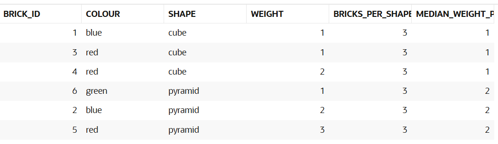
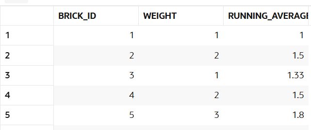
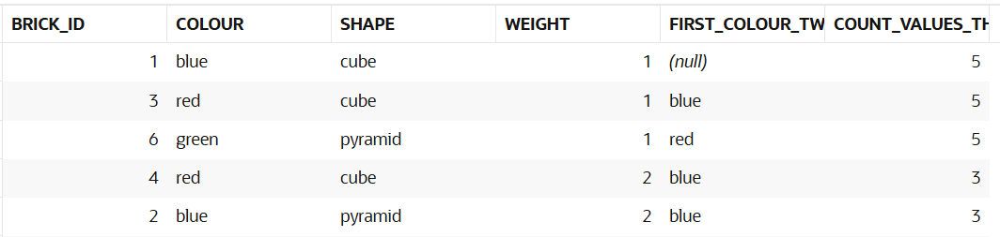
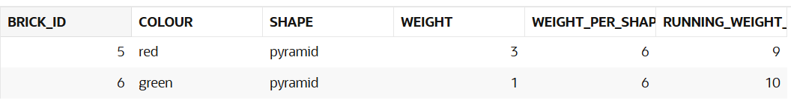

## Free sql explanations
 3. Try it

    Complete the following query to return the count and average weight of bricks for each shape:
    select b.*,
       count(*) over (partition by shape) bricks_per_shape,
       median (weight) over (partition by shape) median_weight_per_shape
    from   bricks b
    order  by shape, weight, brick_id;
Result


In here the windows were created according to the shapes, so it counted how many shapes of each one there were and then the average weight of each type of shape.


5. try it
```
Complete the following query to get the running average weight, ordered by brick_id:

select b.brick_id, b.weight,
       round (avg(weight) over (order by brick_id), 2 ) running_average_weight
from   bricks b
order  by brick_id;

```

Result



The ORDER BY brick_id inside OVER() creates a  window from the first row up to the current row.
The function AVG(weight) calculates the average weight of all rows in that window.

Here are the calculations:

* brick_id = 1, window = [1], running_average = 1 / 1 = 1
* brick_id = 2, window = [1,2], running_average = (1 + 2) / 2 = 1.5
* brick_id = 3, window = [1,2,3], running_average = (1 + 2 + 1) / 3 = 1.33
* brick_id = 4, window = [1,2,3,4], running_average = (1 + 2 + 1 + 2) / 4 = 1.5
* brick_id = 5, window = [1,2,3,4,5], running_average = (1 + 2 + 1 + 2 + 3) / 5 = 1.8

9. Try it
```
Complete the windowing clauses to return:

The minimum colour of the two rows before (but not including) the current row
The count of rows with the same weight as the current and one value following

select b.*,
       min(colour) over (
           order by brick_id
           rows between 2 preceding and 1 preceding
       ) first_colour_two_prev,
       count(*) over (
           order by weight
           range between current row and 1 following
       ) count_values_this_and_next
from bricks b
order by weight;

```
Result


The ORDER BY brick_id inside OVER() combined with
ROWS BETWEEN 2 PRECEDING AND 1 PRECEDING creates a window that contains the two rows before the current row (excluding the current row).

The function MIN(colour) returns the alphabetically smallest colour inside that window.

Here are the windows:

brick_id = 1, window = [], min_colour = NULL
brick_id = 2, window = [1], min_colour = blue
brick_id = 3, window = [1,2], min_colour = blue
brick_id = 4, window = [2,3], min_colour = blue
brick_id = 5, window = [3,4], min_colour = red
brick_id = 6, window = [4,5], min_colour = red


11. Try it

```
Complete the following query to find the rows where

The total weight for the shape
The running weight by brick_id
are both greater than four: 
with totals as (
    select b.*,
           sum(weight) over (
               partition by shape
           ) weight_per_shape,
           sum(weight) over (
               order by brick_id
           ) running_weight_by_id
    from bricks b
)
select *
from totals
where weight_per_shape > 4
  and running_weight_by_id > 4
order by brick_id;
```
Result


The PARTITION BY shape inside OVER() creates a window containing all rows with the same shape.
The function SUM(weight) calculates the total weight for that shape.

The ORDER BY brick_id inside OVER() creates a running window from the first row up to the current row.
The function SUM(weight) calculates the running weight by brick_id.

Finally, the WHERE clause keeps only the rows where both values are greater than 4.