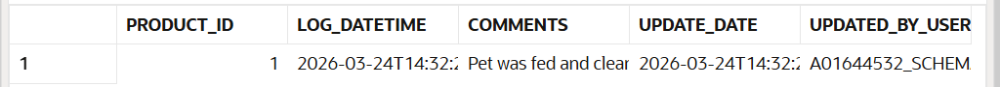

# 1ST TRIGGER
## Result

## Explanation
I learned tht the current time can be obtained with SYSTIMESTAMP and the user can be also get with USER keyword. Also, I learned how to throw an exception in a trigger.

Also, I got  abetter idea of how a trigger actually works:

In a BEFORE INSERT trigger, the database does not execute the insert immediately.
Instead, it first takes the row that the query is trying to insert and holds it temporarily.

At this point, the row is not yet stored in the table.

Then, the trigger runs and can modify that row using :NEW, for example by adding the current timestamp or the current user.

Only after the trigger finishes successfully (no errors), the database proceeds to execute the insert and saves the final modified row into the table.

- Key idea:
 ```
 The BEFORE trigger acts like a checkpoint:

1. The query builds the row
2. The trigger modifies/validates it
3. Only then the row is actually inserted

*If an error occurs in the trigger → the insert is never executed*
 ```

 
# 2nd TRIGGER
## Result

## Explanation


# 3th TRIGGER
## Result

## Explanation
