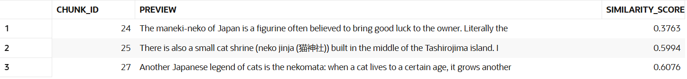
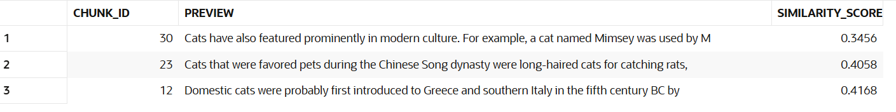
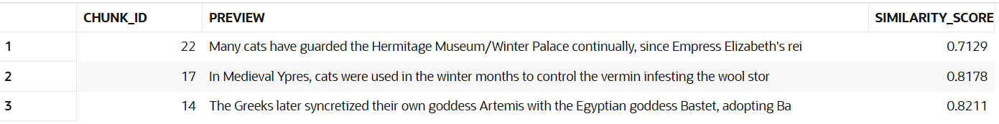

# Articles array
ARTICLES = {
    1: "Cultural depictions of cats",
    2: "Word embedding",
    3: "Semantic search",
}

# Questions 
1. What is maneki-neko?

- The one with the lowest similarity score makes more sense because it refers to the sentence that defines whaat is maneki-neko and the other 2 results haave highest score since it isn't the definition and they have less sense.

2. When did cats became popular in gifts?

- All make sense because they mentioned the cats popularity, the first result found has the best similarity score because it is the start of the paragrpah that talks about the yeaar in which the cats became popular as gifts. Since all are very related to the answer, the similarity score doesn't vary too much.

3. Why did Boswer kidnapped princess Peach?

- The one with the lowest similarity score makes a little bit sense because it returned a paragraph that talk about an empress and a palace which is related to a princess. Thanks to this we can see that it knows a lot abput concepts related, it could relate princess with royalty.
