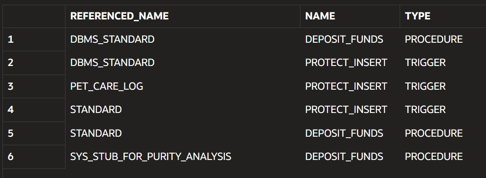
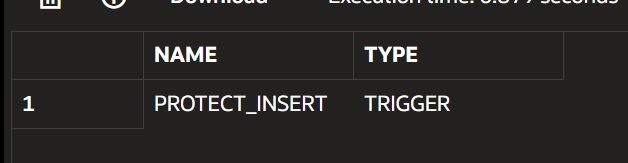

# Excercise 1

In this exercise, I used the prefeined schema Academic(AD) from freesql, using user_objects and I identified the different types of objects that exist in it. The results show that it has 7 tables and 8 indexes, which makes sense because indexes are usually created to optimize queries on tables. I also found 2 sequences, which are typically used for generating unique IDs, along with 1 procedure and 1 trigger, meaning there is some logic implemented at the database level. Additionally, there is 1 LOB object, which suggests that some tables may store large data like text or files. Also, most objects were created around the same time. 

# Excercise 2

I used DBMS_METADATA.GET_DDL to extract the full DDL of all the tables in my schema. The output shows that my schema has 7 tables: ACCOUNTS, CUSTOMER, CUSTOMER_SALE, DOC_CHUNKS, PET_CARE_LOG, PRODUCT, and SALE_ITEM. Each table includes its column definitions, data types, constraints, and some Oracle storage details. I noticed that most tables use NUMBER columns as identifiers, and several tables have primary keys, such as ACCOUNT_ID, CUST_ID, PRODUCT_ID, and composite primary keys like PRODUCT_ID + LOG_DATETIME in PET_CARE_LOG and SALES_ID + PRODUCT_ID in SALE_ITEM. I also identified foreign key relationships: CUSTOMER_SALE references CUSTOMER, PET_CARE_LOG references PRODUCT, and SALE_ITEM references both CUSTOMER_SALE and PRODUCT. Another important part is that the ACCOUNTS table includes a CHECK constraint to make sure the balance is not negative. Also, the DOC_CHUNKS table is different because it uses an identity column for CHUNK_ID and includes a VECTOR(384, FLOAT32) column, which suggests it may be used for storing embeddings or vector data. 

# Excercise 3

In this exercise, I cleaned the DDL output to make it portable. I used EMIT_SCHEMA = false so the generated script does not include my schema name, for example instead of "A01644532_SCHEMA_N2SGD"."ACCOUNTS", it only shows "ACCOUNTS". This is important because now the same DDL can be executed in another schema without editing the owner name manually. I also removed storage, segment attributes, and tablespace information, so the output focuses more on the logical structure of the table instead of physical Oracle configuration. A tablespace is a physical storage container in Oracle where database objects like tables are stored. It defines where the data is actually saved on disk. In the DDL output, tablespaces appear as part of the physical configuration, but they are environment-specific. This means that a tablespace like "USERS" may not exist in another database, which can cause errors during migration. That is why it is removed in this exercise, so the DDL focuses only on the logical structure of the table and can be reused in different environments without issues.

This is important because the original DDL is tightly coupled to a specific Oracle environment, and it may fail if executed in another database. By cleaning it, the script focuses only on the logical structure of the tables, making it easier to reuse, migrate, or share across different schemas or environments without modification.

# Excercise 4

In this exercise, I planned how to migrate my schema to another schema with a different name. I used a table with foreign keys, such as SALE_ITEM, because it references other tables like CUSTOMER_SALE and PRODUCT. This helped me identify that foreign key relationships can include schema-qualified references, for example "A01644532_SCHEMA_N2SGD"."PRODUCT". If I migrate to another schema, those references may need to be removed or updated, otherwise the script could still point to the old schema. Because of this, I would export the DDL with EMIT_SCHEMA = false, review all foreign key constraints, update references if needed, and reload the objects in the correct dependency order.

A migration cchecklist could be something like this:

1. Export all table DDL using DBMS_METADATA.
2. Use EMIT_SCHEMA = false to remove the old schema name.
3. Review all foreign key constraints.
4. Check if any REFERENCES clause points to the old schema.
5. Update schema references if needed.
6. Reload objects in the correct order: tables, constraints, indexes, views, and code.
7. Verify that all tables and relationships were created correctly.

# Excercise 5

This query
```sql
SELECT referenced_name, referencing_name, referencing_type
FROM user_dependencies
```

retuirned this


and it means that name depends on referenced_name. For example deposit_fuinds depends on dbms_standard


This query
```sql
SELECT name, type
FROM user_dependencies
WHERE referenced_name IN (
  SELECT table_name FROM user_tables
)
ORDER BY type, name;

```
Returned this

Which shows a trigger called PROTECT_INSERT, which depends on a table in my schema. This means that the trigger is associated with a table and is executed when certain operations occur, such as inserts. This is important because it shows that triggers cannot be created before the tables they depend on. Therefore, during a migration or restore process, tables must be created first, followed by dependent objects like triggers.

# Excercise 6
In this exercise, I designed a backup strategy assuming that I do not have access to expdp or directory privileges, so I can only use SQL. First, I would document the current schema by checking the number of objects and the existing tables. Then, I would use DBMS_METADATA.GET_DDL to extract the DDL for tables, indexes, sequences, procedures, and triggers. Before extracting the DDL, I would configure the output to remove storage and tablespace details, making the script cleaner and more portable. Since this method only exports the structure and not the data, I would save the generated SQL statements into a .sql file and execute them in the new schema using the correct order: tables first, then sequences, indexes, constraints, views, code, and triggers. Finally, I would verify the migration by comparing object counts, table names, and indexes between the original and new schema. (Check the more detailed process im the readme that defines wgat to do in excercise 6)